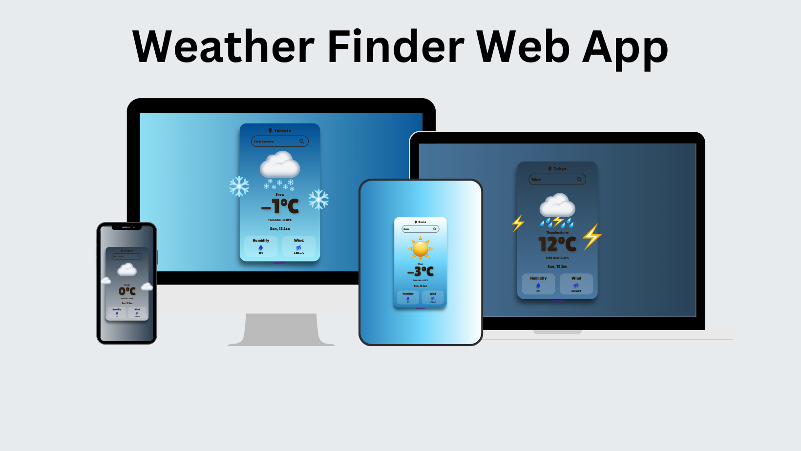

# Weather Finder

**Weather Finder** is a user-friendly web application designed to provide real-time weather updates for any location worldwide. Built with React, this app fetches weather data from the OpenWeather API, allowing users to view the current temperature, weather conditions, and "feels-like" temperature. The app offers a straightforward interface for quick searches and ensures an easy, informative experience. Wh

## Features

- **Search for any location**: Get current weather information for any city.
- **Detailed weather data**: View temperature, weather conditions, and "feels like" temperature.
- **Smooth user experience**: Easily search for weather updates with a clean and simple interface.
- **Error handling**: Informative feedback when a location is not found.
- **Loading animation**: Visual feedback while fetching data.
- **Weather display**: Weather conditions are represented using Apple emojis, personally customized, to create a visually appealing and unique experience.

## Live Site
The Weather Finder App is hosted on Netlify. You can view the live app at the following URL:

https://weather-finder-aishwinj.netlify.app/

## Usage

- **Default Weather**: The app initially displays the weather for Toronto.
- **Location Search**: Users can search for any city to view real-time weather updates.
- **Error Handling**: If a location cannot be found, a message is displayed to the user.

# OpenWeather API
https://openweathermap.org/current#name
